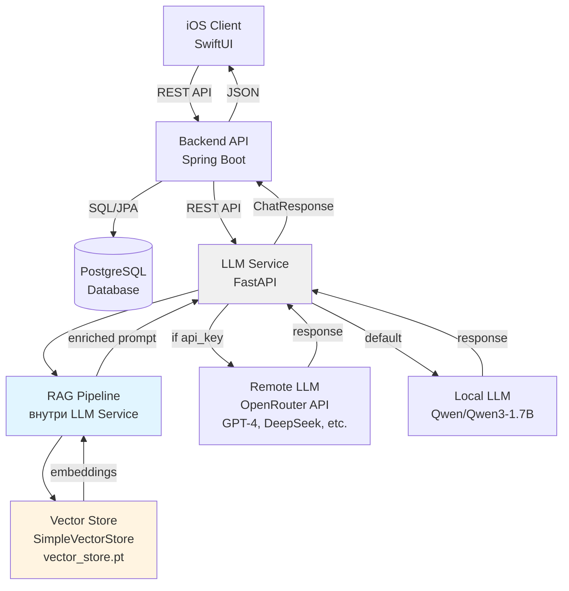

# Halal AI

Halal AI — это интеллектуальное мобильное приложение для iOS, которое помогает пользователям быстро получать ответы на вопросы, связанные с халяль-образом жизни. Система использует LLM (Large Language Models) с технологией RAG (Retrieval-Augmented Generation) для обработки запросов на естественном языке, обеспечивая точные и основанные на исламских источниках ответы.


## Архитектура

Проект построен по принципу микросервисной архитектуры с разделением ответственности:

### Компоненты системы

* **iOS Client (SwiftUI)**
  - Мобильное приложение для iOS
  - Интерфейс для общения с AI-ассистентом
  - Аутентификация пользователей
  - Управление настройками (выбор модели, API ключи)
  - Технологии: Swift, SwiftUI, Combine

* **Backend API (Java Spring Boot)**
  - REST API для обработки запросов от iOS клиента
  - Аутентификация и авторизация (JWT)
  - Маршрутизация запросов к LLM Service
  - Управление пользователями и сессиями
  - Технологии: Java 17+, Spring Boot, Spring Security, Spring Data JPA

* **Database (PostgreSQL)**
  - Хранение данных пользователей (учетные записи, настройки)
  - Хранение истории сессий и обратной связи
  - Технологии: PostgreSQL, JPA/Hibernate

* **LLM Service (Python FastAPI)**
  - Микросервис для генерации ответов с использованием LLM
  - **RAG Pipeline** (внутри LLM Service):
    - Векторный поиск по базе знаний (аяты, хадисы, фетвы)
    - Обогащение промпта релевантным контекстом
    - Хранение векторных эмбеддингов в файловом хранилище
  - Поддержка двух режимов генерации:
    - **Local LLM**: Локальная модель Qwen/Qwen3-1.7B (по умолчанию)
    - **Remote LLM**: Удаленные модели через OpenRouter API (GPT-4, DeepSeek, Mimo и др.)
  - Технологии: Python, FastAPI, PyTorch, Transformers, Sentence Transformers

* **Vector Store (внутри LLM Service)**
  - Файловое хранилище векторных эмбеддингов (`vector_store.pt`)
  - Используется RAG Pipeline для семантического поиска
  - Технологии: PyTorch тензоры, косинусное сходство

## Схема архитектуры

### Mermaid Diagram


## Основные функции

* **Чат с AI-ассистентом**
  - Интеллектуальные ответы на вопросы об исламе
  - Поддержка контекстной беседы с историей сообщений
  - Использование RAG для точных ответов на основе исламских источников

* **Гибкая конфигурация моделей**
  - Использование локальной модели по умолчанию (бесплатно)
  - Возможность подключения удаленных моделей через OpenRouter
  - Настройка параметров генерации (max_tokens, температура)

* **Аутентификация и безопасность**
  - Регистрация и вход пользователей
  - JWT токены для авторизации
  - Защита API endpoints

* **База знаний (RAG)**
  - Векторный поиск по исламским источникам
  - Автоматическое обогащение ответов релевантным контекстом
  - Возможность добавления новых документов в базу знаний

## Структура проекта

```
HalalAIMono/
├── HalalAI-ios/              # iOS приложение
│   └── HalalAI/
│       ├── App/             # Точка входа
│       ├── Screens/         # Экраны приложения
│       ├── Services/        # Сервисы для API
│       └── Coordinators/    # Навигация
│
├── HalalAI-backend/
│   ├── HalalAI-backend-main/  # Spring Boot Backend
│   │   └── src/main/java/
│   │       ├── controller/    # REST контроллеры
│   │       ├── service/       # Бизнес-логика
│   │       ├── repository/    # Репозитории JPA
│   │       └── model/         # Модели данных
│   │
│   └── LLM-service/          # Python LLM Service
│       ├── main.py           # FastAPI приложение
│       ├── services/         # Локальная LLM
│       ├── rag/              # RAG Pipeline
│       └── data/             # Vector Store
│
└── README.md
```
