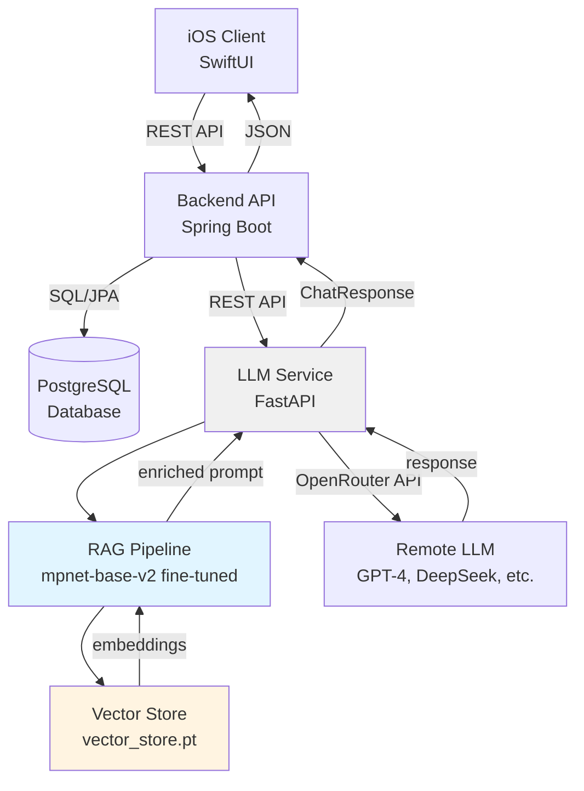

# Halal AI

Halal AI — интеллектуальное мобильное приложение для iOS, помогающее мусульманам в повседневной жизни. Система использует LLM с технологией RAG (Retrieval-Augmented Generation) для точных ответов на основе исламских источников, а также включает модули расчёта времени намаза, чтения Корана, сканирования состава продуктов и поиска халяль-заведений.


## Архитектура

Проект построен по принципу микросервисной архитектуры с разделением ответственности:

### Компоненты системы

* **iOS Client (SwiftUI)**
  - Мобильное приложение для iOS 17+
  - AI-ассистент с поддержкой RAG по текстам Корана
  - Расчёт времени намаза
  - Чтение Корана с поддержкой всех сур и аятов
  - Сканирование состава продуктов (халяль/харам/сомнительно)
  - Поиск халяль-заведений на карте
  - Система уведомлений о намазе (мазхаб, метод расчёта)
  - Локализация (русский, английский)
  - Технологии: Swift, SwiftUI, `@Observable`, Coordinator pattern

* **Backend API (Java Spring Boot)**
  - REST API для iOS-клиента
  - Аутентификация и авторизация (JWT)
  - Маршрутизация запросов к LLM Service
  - Управление пользователями и сессиями
  - Технологии: Java 17+, Spring Boot, Spring Security, Spring Data JPA, PostgreSQL

* **LLM Service (Python FastAPI)**
  - RAG Pipeline: семантический поиск по аятам Корана
  - Векторные эмбеддинги: fine-tuned `mpnet-base-v2`
  - Поддержка удалённых моделей через OpenRouter API (GPT-4, DeepSeek и др.)
  - Технологии: Python, FastAPI, PyTorch, Sentence Transformers

* **Database (PostgreSQL)**
  - Данные пользователей, история сессий
  - Автоматический запуск через Docker Compose

### Схема архитектуры


```mermaid
graph TB
    iOS[iOS Client<br/>SwiftUI] -->|REST API| Backend[Backend API<br/>Spring Boot]
    Backend -->|SQL/JPA| DB[(PostgreSQL<br/>Database)]
    Backend -->|REST API| LLM[LLM Service<br/>FastAPI]

    LLM --> RAG[RAG Pipeline<br/>mpnet-base-v2 fine-tuned]
    RAG --> Vector[Vector Store<br/>vector_store.pt]
    Vector -->|embeddings| RAG

    RAG -->|enriched prompt| LLM
    LLM -->|OpenRouter API| Remote[Remote LLM<br/>GPT-4, DeepSeek, etc.]

    Remote -->|response| LLM
    LLM -->|ChatResponse| Backend
    Backend -->|JSON| iOS

    style RAG fill:#e1f5ff
    style Vector fill:#fff4e1
    style LLM fill:#f0f0f0
```

## Основные функции

* **Чат с AI-ассистентом**
  - Ответы на вопросы об исламе на основе текстов Корана (RAG)
  - Контекстная беседа с историей сообщений
  - Поддержка кастомных моделей через OpenRouter

* **Расчёт времени намаза**
  - Астрономический алгоритм
  - Поддержка мазхабов и методов расчёта
  - Уведомления на 5 намазов × 7 дней

* **Чтение Корана**
  - Доступ ко всем сурам и аятам
  - Настройка размера шрифта
  - Запоминание последнего места чтения

* **Сканер состава продуктов**
  - Распознавание ингредиентов через камеру
  - Классификация: халяль / харам / мушбух
  - Поддержка E-кодов и названий на русском и английском

* **Поиск халяль-заведений**
  - Карта с ближайшими халяль-ресторанами и магазинами

* **Гибкая конфигурация LLM**
  - Модель по умолчанию (бесплатно)
  - Подключение собственных моделей через OpenRouter API

## Структура проекта

```
HalalAIMono/
├── HalalAI-ios/
│   └── HalalAI/
│       ├── App/              # Точка входа, DI-контейнер
│       ├── Features/         # Функциональные модули
│       │   ├── Auth/         # Авторизация
│       │   ├── Chat/         # AI-ассистент
│       │   ├── Home/         # Главный экран, намаз
│       │   ├── Prayer/       # Настройки намаза
│       │   ├── Quran/        # Чтение Корана
│       │   ├── Scanner/      # Сканер состава
│       │   ├── HalalMap/     # Карта заведений
│       │   └── Settings/     # Настройки приложения
│       ├── Core/             # Сервисы, компоненты, локализация
│       ├── Navigation/       # Coordinator-паттерн
│       └── Resources/        # Ассеты, локализация (ru/en)
│
├── HalalAI-backend/
│   ├── HalalAI-backend-main/ # Spring Boot Backend
│   │   └── src/main/java/
│   │       ├── controller/   # REST контроллеры
│   │       ├── service/      # Бизнес-логика
│   │       ├── repository/   # Репозитории JPA
│   │       └── model/        # Модели данных
│   │
│   ├── LLM-service/          # Python LLM Service
│   │   ├── main.py           # FastAPI приложение
│   │   ├── rag/              # RAG Pipeline
│   │   ├── models/           # Векторные модели
│   │   └── data/             # Vector Store
│   │
│   └── docker-compose.yml    # Полный стек
│
├── Diploma-latex/            # Текст ВКР (LaTeX, СПбПУ)
└── README.md
```

## Быстрый старт

**Вся система (iOS + Backend + LLM Service):**
```bash
cd HalalAI-backend
docker-compose up -d
```

Запустит:
- PostgreSQL (БД)
- LLM Service (FastAPI, порт 8001)
- Spring Boot Backend (порт 8080)

**iOS:**
```bash
open HalalAI-ios/HalalAI.xcodeproj
```

## Окружение

| Компонент | Требования |
|-----------|------------|
| iOS | Xcode 26+, Swift 5.10+, iOS 17+ |
| Backend | Java 17+, Maven |
| LLM Service | Python 3.9+, pip |
| БД | PostgreSQL 13+ (через Docker) |
